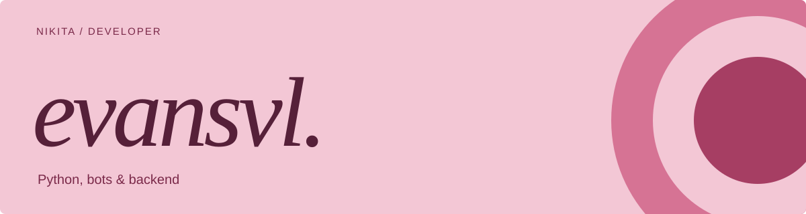

  

  
  
  

## Привет, я Никита 👋

Пишу ботов, backend и инструменты, которые избавляют от ручной работы. Мой основной язык — **Python**. Люблю разбирать чужие API, связывать сервисы между собой и доводить всё до работающего продукта.

Занимаюсь коммерческой разработкой с **2023 года**. Делаю свои проекты и беру заказы: от Telegram-бота с платежами до API, мобильного приложения и развёртывания на сервере.

### Что делаю

- **Telegram & Discord** — боты, магазины, подписки, платежи и интеграции.
- **Backend** — асинхронные API, вебхуки, базы данных и фоновые задачи.
- **Инфраструктура** — Linux, Docker, Nginx, HTTPS и обслуживание VPS.
- **Автоматизация** — скрипты, работа с внешними API и эксперименты с локальными LLM.

### Стек

  
  
  
  
  
  
  
  
  

Для интерфейсов и мобильных проектов также использую **JavaScript / TypeScript, React и Flutter / Dart**. Основной фокус — Python и backend.

### Из того, что можно посмотреть

| Проект | Что внутри |
| --- | --- |
| [⭐ Telegram Stars Bot](https://github.com/evansvl/telegram-stars-bot) | Open-source магазин Stars: платежи, автоматическая выдача, рефералы и партнёрские боты. Python, aiogram, PostgreSQL, Redis, Docker. |
| [📱 IT Top Diary](https://github.com/evansvl/it-top-diary) | Неофициальный электронный дневник Top Academy для телефона: расписание, оценки, домашние задания и уведомления об обновлениях. |
| [🎮 FACEIT Widget](https://github.com/evansvl/faceit-widget) | Автоматическое обновление Discord-виджета со статистикой FACEIT: уровень, Elo и последний матч. |
| [🧩 Fragment API Python](https://github.com/evansvl/fragment-api-py) | Мой форк Python-библиотеки для автоматизации Fragment. |

### Есть идея или задача?

Можно прийти с готовым ТЗ или просто объяснить, что хочется автоматизировать.

**[Написать в Telegram ↗](https://t.me/hahahahgaha)** · **[Портфолио ↗](https://t.me/evansvl_bio)** · **[Отзывы ↗](https://t.me/evansvl_reviews)**

---

Python first. Любопытство — по умолчанию.

